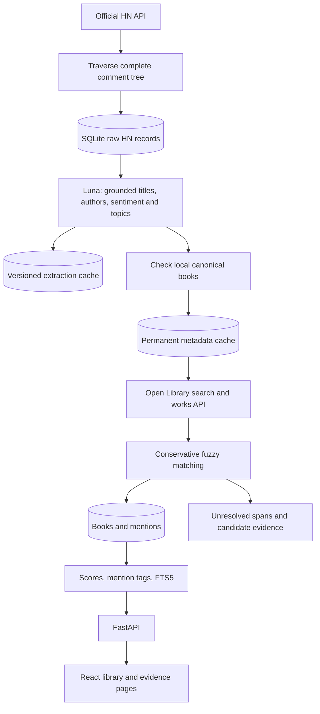

# First milestone architecture

One process serves FastAPI and the built React assets. A daily CLI process uses the same image and SQLite volume. There are no queues, brokers, or background web tasks.



## Persistence and failure behavior

HN item IDs are primary keys. Every raw item commits before extraction starts; deleted comments are stored and their children are traversed. A failed child produces a partial run and a nonzero CLI exit code; successful raw items remain available. The next ingestion revisits all descendants and retries missing items. No depth or comment-count truncation is used.

Each comment has a hash of its raw JSON, supplied ancestor/thread context, model, prompt, topic names and processor version. Unchanged processed comments are skipped unless they have unresolved mentions. Derived mentions for a changed comment are replaced in one transaction after resolution completes. Deleted/dead comments have their derived mentions removed. Reprocessing reads raw records. Offline mode requires cached model results and restricts metadata access to cached responses.

External search responses, including successful empty results, are cached permanently. Transient errors are not cached. Open Library work IDs deduplicate editions. Title similarity must reach 0.94, supplied authors must agree, and similarly scored distinct works are held unresolved. Low-confidence candidates never become placeholder books. Metadata and HN evidence occupy distinct records. Negative or neutral evidence is preserved.

Historical discovery searches a bounded UTC interval with configured title queries, using either Ask HN or all story tags. Capped Algolia searches are recursively split at integer timestamp boundaries so adjacent windows have no gaps or overlaps. Duplicate hits are collapsed by HN item ID. Discovery cannot establish coverage outside the configured queries or upstream index.

The additive `thread_checkpoints` table records whether a complete raw tree was fetched and which processor version finished it. Backfill skips completed threads, reuses complete raw trees after processing failures, and refetches interrupted or partial trees. It rebuilds aggregates after each thread so long jobs publish incremental results. CLI limits count pending attempts, allowing repeated batches to advance through the corpus. The checkpoint does not require every bibliographic span to resolve; transient upstream failures prevent successful processing checkpoints.

SQLite uses WAL, foreign keys, a 30-second busy timeout, and a process lock shared by CLI commands. Web requests read aggregates while ingestion works. Reprocessing rebuilds score and FTS aggregates together in a transaction. Schedule one ingestion process, and keep the database on local storage rather than a network filesystem.

## Ranking version 2

A positive recommendation has sentiment > 0 and strength >= 0.6. Raw mention and
recommendation counts retain the historical evidence. Distinct recommenders count
known readers whose latest non-neutral opinion is positive. A subsequent neutral
reading update does not erase an opinion. Each reader contributes once per book
across all threads and dates. Conflicting opinions with identical timestamps
abstain rather than letting input order decide.

Positive opinions contribute their recommendation strength (Luna maps praise to
0.65 and an explicit recommendation to 0.95); negative opinions subtract 0.5.
Unidentified readers share one latest opinion, weighted at 0.25, and never count
as independent users. The anonymous bucket is distinct from any actual username.
Neutral mentions neither add nor subtract score. Scores cannot be negative.

```
weight = 1 for a known reader, 0.25 for the anonymous bucket
support = sum(weight × positive_strength)
opposition = sum(weight × 0.5 for negative opinions)
n = sum(weight for positive opinions)
support_multiplier = n / (n + 2)
diversity = 1 + min(0.1 × log(max(1, positive_threads)), 0.15)
              + min(0.05 × log(max(1, positive_dates)), 0.1)
all_time = max(0, support - opposition) × support_multiplier × diversity
recent = max(0, decayed_support - decayed_opposition) × support_multiplier × diversity
decay = 0.5 ** (max(0, age_days) / 365)
```

The support multiplier reduces isolated endorsements; it is a ranking heuristic,
not a calibrated probability. Independent support across threads/dates adds at
most 25%. Word count and thread popularity no longer boost a book: a long list
is not evidence that each book was thoughtfully recommended, and story upvotes
do not rate individual book opinions. Scores depend on extracted classifications,
which still require complete source review.

`score_details` records positive/critical readers, weighted support/opposition,
conflicts, diversity and formula version. All-time scores do not decay. Recent
ranking decays both support and criticism using a 365-day half-life. “Most
recommended” sorts by distinct current recommenders, followed by score. Titles
and IDs break ties consistently for the infinite feed. “Most mentioned” retains
raw frequency sorting.

Web startup upgrades stale ranking versions in one SQLite transaction using
stored mentions only. It does not call HN, metadata services or Luna, modify raw
evidence/cache, or rebuild extraction. An interrupted upgrade rolls back all
score changes; a second worker checks the version again after acquiring the
write lock. Normal ingestion/rebuilds and `app.recompute rankings` use the same
formula. Increment `FORMULA_VERSION` for ranking-only changes, leaving extraction
and processing cache versions unchanged.

See [the ranking validation notes](ranking.md) for sensitivity checks and limits.

## Luna extraction and library replacement

Luna uses the Responses API with strict JSON output, `store: false`, and reasoning
set to `none`. The current comment is never truncated. At most two ancestors plus
the thread body provide context; each contextual text is limited to 6,000 characters.
The output holds complete titles, author provenance, exact excerpts from the current
comment, topics and a sentiment category per work. Categories map to the existing
ranking values. The model may return no mentions. All successful outputs are cached,
including empty results. Model/prompt/context changes invalidate cache keys and
processing checkpoints. Failed, incomplete or ungrounded outputs are not cached.
No automatic regex fallback occurs.

Luna identities require an author or an actual Open Library work link. Supplied
or inferred authors must match metadata. Search and work titles and available work
authors are checked before inserting a canonical record. This prevents an authorless
famous-title mention from becoming a publisher's adaptation. Ambiguous/unverified
works remain unresolved and appear in the JSON review export with extraction evidence.

`app.rebuild` holds the live writer lock, makes and integrity-checks a unique SQLite
backup, and builds only the chosen thread in a separate resumable database. Old
canonical records and mentions are not reused. Metadata/extraction caches can be
reused. A failed fetch or upstream processing error leaves the live library intact.
After complete processing and database/reference checks, SQLite's backup API publishes
the staged database transactionally; no live WAL database is unlinked or renamed.

The legacy extraction/evaluation code remains available only through explicit
`EXTRACTION_BACKEND=heuristic` or `app.evaluate`, for offline comparisons. Mock API
tests verify integration and recovery behavior, not model accuracy. Review real Luna
outputs on thread 49893157 before extending the corpus. Inferred authors, sarcasm,
ambiguous references and series-versus-volume identities can still be wrong.

FTS5 remains lexical retrieval without embeddings. Vectors, clustering,
co-recommendation graphs and personalized recommendations are deferred.
