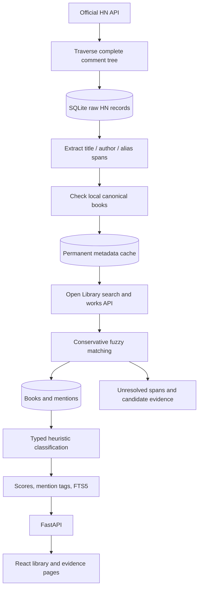

# First milestone architecture

One process serves FastAPI and the built React assets. A daily CLI process uses the same image and SQLite volume. There are no queues, brokers, or background web tasks.



## Persistence and failure behavior

HN item IDs are primary keys. Every raw item commits before extraction starts; deleted comments are stored and their children are traversed. A failed child produces a partial run and a nonzero CLI exit code; successful raw items remain available. The next ingestion revisits all descendants and retries missing items. No depth or comment-count truncation is used.

Each comment has a hash of its raw JSON plus the processor version. Unchanged processed comments are skipped unless they have unresolved mentions. Derived mentions for a changed comment are replaced in one transaction after resolution completes. Deleted/dead comments have their derived mentions removed. Reprocessing reads raw records and optionally restricts metadata access to cached responses.

External search responses, including successful empty results, are cached permanently. Transient errors are not cached. Open Library work IDs deduplicate editions. Title similarity must reach 0.94, supplied authors must agree, and similarly scored distinct works are held unresolved. Low-confidence candidates never become placeholder books. Metadata and HN evidence occupy distinct records. Negative or neutral evidence is preserved.

Historical discovery searches a bounded UTC interval with configured title queries, using either Ask HN or all story tags. Capped Algolia searches are recursively split at integer timestamp boundaries so adjacent windows have no gaps or overlaps. Duplicate hits are collapsed by HN item ID. Discovery cannot establish coverage outside the configured queries or upstream index.

The additive `thread_checkpoints` table records whether a complete raw tree was fetched and which processor version finished it. Backfill skips completed threads, reuses complete raw trees after processing failures, and refetches interrupted or partial trees. It rebuilds aggregates after each thread so long jobs publish incremental results. CLI limits count pending attempts, allowing repeated batches to advance through the corpus. The checkpoint does not require every bibliographic span to resolve; transient upstream failures prevent successful processing checkpoints.

SQLite uses WAL, foreign keys, a 30-second busy timeout, and a process lock shared by CLI commands. Web requests read aggregates while ingestion works. Reprocessing rebuilds score and FTS aggregates together in a transaction. Schedule one ingestion process, and keep the database on local storage rather than a network filesystem.

## Ranking version 1

A positive recommendation has sentiment > 0 and strength >= 0.6. Mention counts, positive recommendation counts, and distinct known recommending usernames are separate statistics.

A user/thread/UTC-date context contributes its strongest positive recommendation once. Missing usernames share an `unknown` context within a thread/date and do not count as independent users.

```
quality = 1 + min(log(1 + thread_score) / 20, 0.3)
explanation = 0.2 × min(context_word_count / 80, 1)
contribution = strength × (quality + explanation)
diversity = 1 + 0.15 × log(1 + positive_threads) + 0.1 × log(1 + positive_dates)
all_time = sum(context_contributions) × diversity
recent = sum(contribution × 0.5 ** (age_days / 365)) × diversity
```

Thread score is used because the official HN API does not expose reliable comment scores. Length is a deliberately simple explanation proxy. `score_details` records formula version and factors. All-time scores do not decay. All-time scores can change when thread scores or comments change.

## Known limits and next experiments

Extraction detects configured aliases, known titles, emphasis, quoted text, book links, title/author phrases, reading cues, and list items. It misses unconstrained prose and can extract quoted non-book text. Such spans remain unresolved unless bibliographic matching succeeds. The alias list is curated; it is not an exhaustive book catalog.

Classification is a fast, ingestion-time keyword baseline. Sentiment uses the sentence containing each mention so separate books can have opposing recommendations. Tags use the same context plus the extracted canonical title; metadata subjects are retained separately and are not represented as HN-derived tags. Negation, sarcasm, and implied recommendations remain limitations.

FTS5 supports natural search phrases after removing a small set of query filler words. It is lexical retrieval, without embeddings. Polars, scikit-learn, vectors, clustering, co-recommendation graphs, and recommendation experiments are deferred until the corpus and golden evaluation justify them. There is no `/api/clusters` placeholder or runtime LLM.

The initial golden corpus includes 15 synthetic comments, four manually labeled source-linked HN comments, and six synthetic canonicalization cases. It is a regression fixture, not a representative measurement of real-world accuracy. Expand it with ambiguous works, authors, and unsupported extraction patterns before comparing algorithms.
